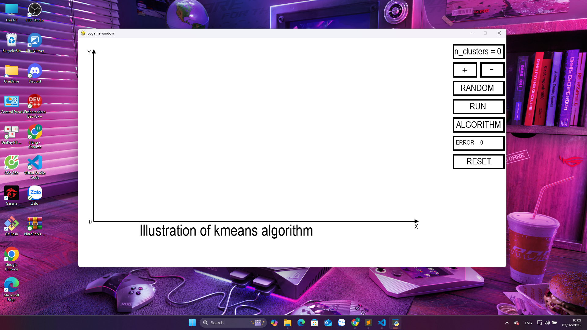
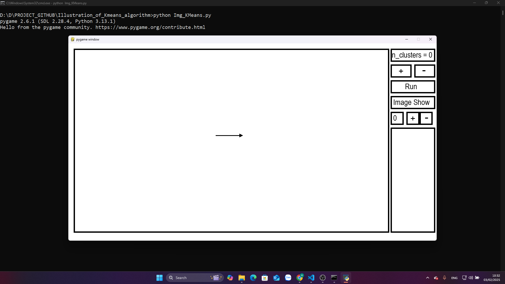

# trước khi chạy chương trình thì mở terminal gõ: pip install -r requirements để cài đặt các thư viện để chạy chương trình
# sau đó chạy file KMeans.py thì sẽ chạy được chương trình minh họa thuật toán kmeans và cách tiến hành thuật toán hình ảnh sau khi chạy: 

[Video demo](https://youtu.be/TWBFik1oE0U)
# Ta áp dụng thuật toán KMeans vào xử lý ảnh. Chạy file Img_KMeans.py hình ảnh sau khi chạy: 

[Video demo](https://youtu.be/9KUuzOT_w2g) 

